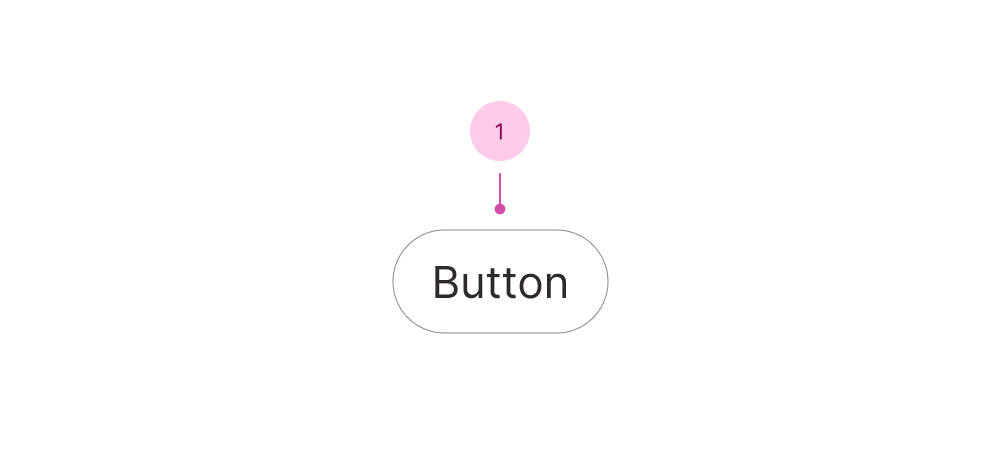

## Anatomy

1. Button

## Use case

<Do11yDoDont heading-tag="h2" do-title="Use when.." dont-title="Avoid when..">

<template v-slot:do>

- Submitting a form.
- Calculating results.
- Starting a new process.

</template>

<template v-slot:dont>

- Navigating the user to another website, page or area on the page, use [Link](/c/link).
- Downloading content instantly, use [Download link](/c/download-link).
- Copying content, use [Copy button](/c/copy-button).

</template>

</Do11yDoDont>

## Disabled buttons

A disabled button can cause confusion as to why it has been disabled and how to enable it. Usually the more user-friendly alternative is to keep the button active and display an error message when the user clicks it. That way we avoid more guesswork for the user.

However, if you _must_..

<Do11yDoDont>

<template v-slot:do>

Use supporting text that stays visible when relevant to explain _why_ the button is disabled.

</template>

<template v-slot:dont>

Use a hidden tooltip to explain why the button is disabled.

</template>

</Do11yDoDont>

### Contrast

WCAG does not require sufficient contrast for disabled buttons, _however_ meaningful content content should be accessible to everyone. If your disabled button truly does not convey meaning, it is likely best not to show it at all.
