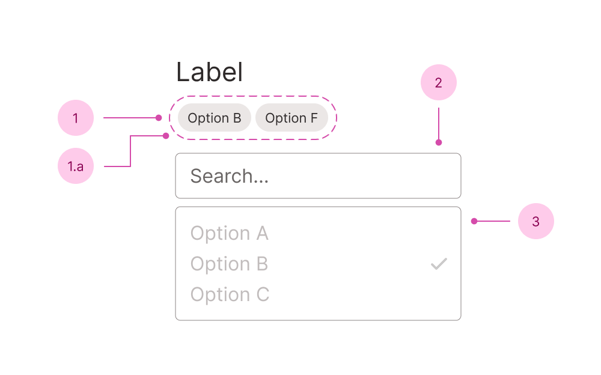

## Anatomy

1. Selection list - a list of the selected items (intended for `multiselect`)
   1. Selection list item - the selected item
2. Input - used for seaching the options
3. Listbox - see the full anatomy on the [listbox field page](/f/listbox-field)

You'll find the label, descriptions and error messages documented in the [field component](/f/field).

## Use case

<Do11yDoDont do-title="Use when.." dont-title="Avoid when..">

<template v-slot:do>

- Choosing from a long list of options.
- The options benefit from filtering.

</template>

<template v-slot:dont>

- Few options - use a radio or a checkbox group.
- Few options, but you want to save space - use [Select Field](/f/select-field).

</template>

</Do11yDoDont>

## Resources

- [\<select> your poison](https://sarahmhigley.com/writing/select-your-poison/) by Sarah Higley - insights to Sarah's usability tests for selects and comboboxes.
