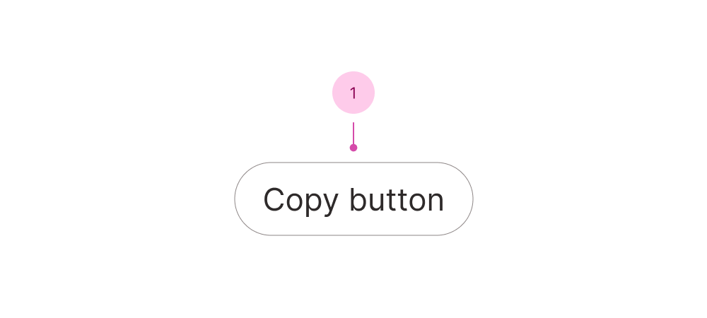

## Anatomy

1. Copy button

## Use case

<Do11yDoDont do-title="Use when.." dont-title="Avoid when..">

<template v-slot:do>

- Copying content.

</template>

<template v-slot:dont>

- Downloading content instantly, use [Download link](/c/download-link).

</template>

</Do11yDoDont>

## Disabled buttons

The [guidelines for a disabled button](/c/button#guidelines) are relevant to the copy button too.
