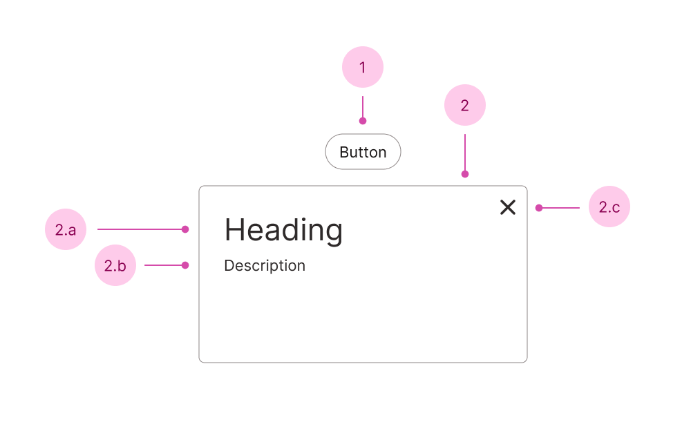

## Anatomy

1. Button - opens the dialog
2. Panel - the dialog
   1. Heading
   2. Description
   3. Close button

## Use case

<Do11yDoDont do-title="Use when.." dont-title="Avoid when..">

<template v-slot:do>

- You want the user to focus on a specific task.
- There is an urgent decision to be made (set `modal` to `"alert"`.).

</template>

<template v-slot:dont>

- The content requires _prolonged_ interaction or a step-by-step process, use a new page.

</template>

</Do11yDoDont>
