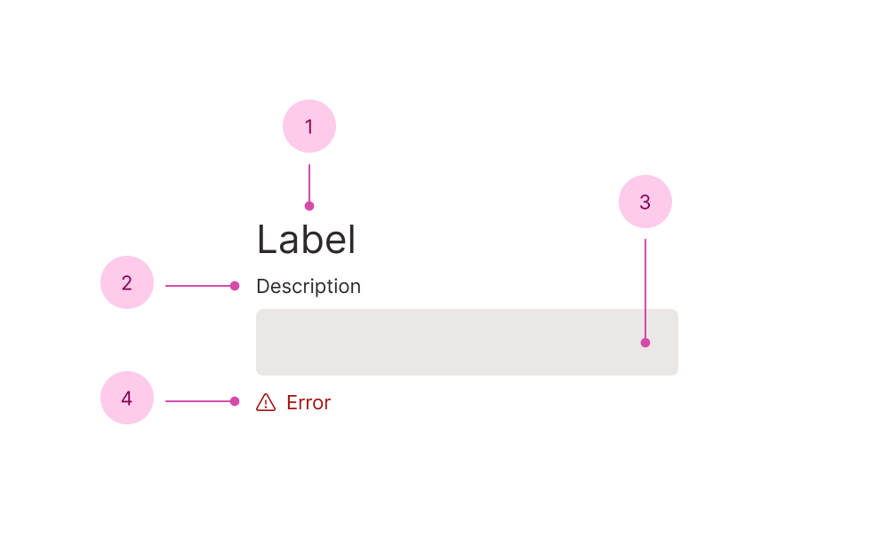

<script setup>
  import { computed } from 'vue';
  import { useRoute } from 'vue-router';

  import routes from "do11y:routes";

  import FieldSandbox from './Field.sandbox.vue';

  import FieldDescriptionMeta from '../FieldDescription.vue?meta';
  import FieldErrorMeta from '../FieldDescription.vue?meta';
  import FieldLabelMeta from '../FieldDescription.vue?meta';

  const route = useRoute();

  const fieldRoutes = computed(() => {
    return routes
        .filter((r) => r.path.startsWith("/f") && r.meta.title !== 'Field')
        .map(r => r.meta.title);
  });
</script>

# {{ route?.meta.title }}

<div class="description">
  {{ route?.meta.description }}
</div>

<FieldSandbox title="Field" block-size="24rem" />

## Anatomy



1. Label
2. Description
3. *Field sub-components - see the full anatomy on the field's page
4. Error

### API

```vue
<template>
  <*Field>
    <PeachyFieldLabel />
    <PeachyFieldDescription />

    <!-- *Field sub-components -->

    <PeachyFieldError v-if="error" />
  </*Field>
</template>
```

You should only render the error sub-component when there is an actual error, as it will mark the field invalid (e.g. use `v-if` instead of `v-show`).

## The {{ fieldRoutes.length }} fields

<Do11yComponentGrid :components="fieldRoutes" />
