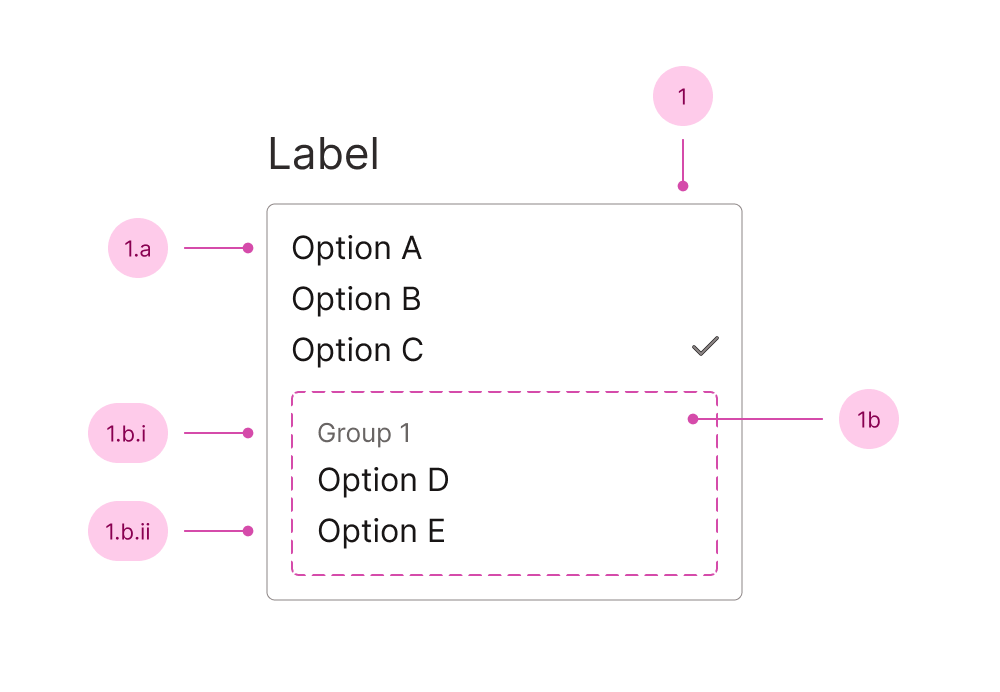

## Anatomy

1. Input - the list of options
   1. Option
   2. Group - a group of options
      1. Group label
      2. Option (grouped)

You'll find the label, descriptions and error messages documented in the [field component](/f/field).

## Use case

<Do11yDoDont do-title="Use when.." dont-title="Avoid when..">

<template v-slot:do>

- Choosing from a long list of options.
- You want to save on space.

</template>

<template v-slot:dont>

- There are few options - use a radio or a checkbox group.
- You want multiselect. Though the component supports it - it's not great for user friendliness, use [Combobox Field](/f/combobox-field) or a checkbox group, when possible.
- The options benefit from filtering, use [Combobox Field](/f/combobox-field).

</template>

</Do11yDoDont>
