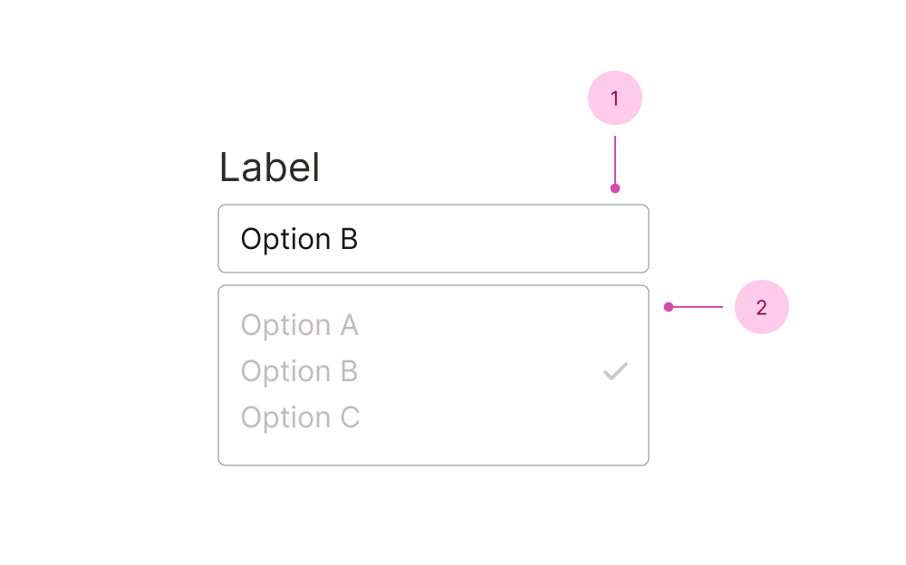

## Anatomy

1. Button - where the selected options are put
2. Listbox - see the full anatomy on the [listbox field page](/f/listbox-field)

You'll find the label, descriptions and error messages documented in the [field component](/f/field).

## Use case

<Do11yDoDont do-title="Use when.." dont-title="Avoid when..">

<template v-slot:do>

- The user is going to pick one or more options from a big list.
- Typeahead and extensive keyboard navgiation might be beneficial.
- Making an input to let users categorize their selection. <em>Example to come!</em>

</template>

<template v-slot:dont>

- You only want the typeahead and extensive keyboard navgiation, use a select.
- It would be better for the user to _search_ through the options, use a combobox.
- There are very few options, use a radio or a group of checkboxes.

</template>

</Do11yDoDont>

## Resources

- [\<select> your poison](https://sarahmhigley.com/writing/select-your-poison/) by Sarah Higley - insights to Sarah's usability tests for selects and comboboxes.
