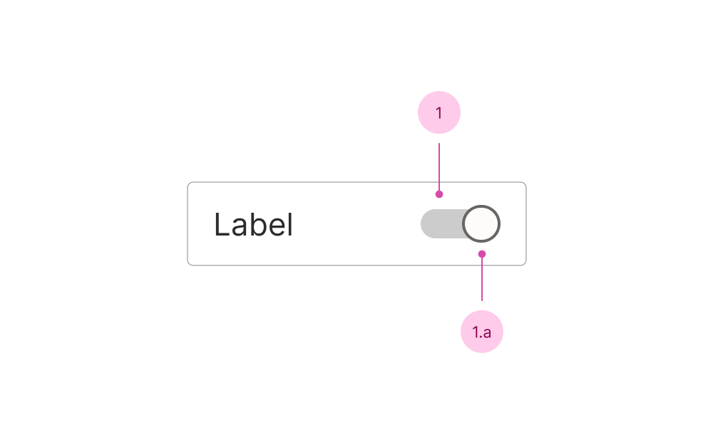

## Anatomy

1. Track - the control
   1. Thumb - the visual indicator for which side is "on"

You'll find the label, descriptions and error messages documented in the [field component](/f/field).

## Use case

<Do11yDoDont do-title="Use when.." dont-title="Avoid when..">

<template v-slot:do>

- You want to turn a single option on or off.
- The user expects an immediate effect.

</template>

<template v-slot:dont>

- As an input in a form, use a radio or checkbox.
- Toggling between different options, use a radio.
- You want to trigger an _action_, use [Button](/c/button).

</template>

</Do11yDoDont>
