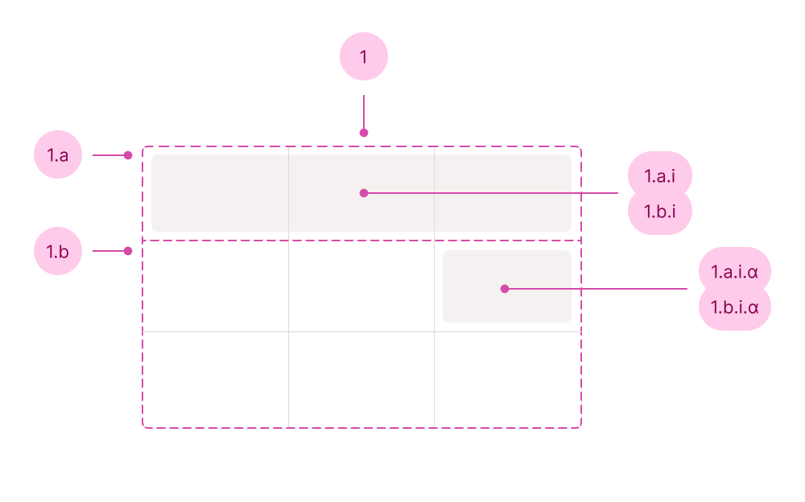

## Anatomy

1. Table
   1. Table head
      1. Table row (or table heading row)
         1. Heading cell
   1. Table body
      1. Table row
         1. Cell (can be set as `heading` for the row)

## Use case

<Do11yDoDont do-title="Use when.." dont-title="Avoid when..">

<template v-slot:do>

- You need to visualize data by rows and columns.
- The content could benefit from sorting.

</template>

<template v-slot:dont>

- The table requires spreadsheet functionality or is heavily filled with controls, use [Grid Table](/c/grid-table).
- The table is a calendar either as a standalone or part of a date picker, use [Calendar Table](/c/calendar-table).

</template>

</Do11yDoDont>
