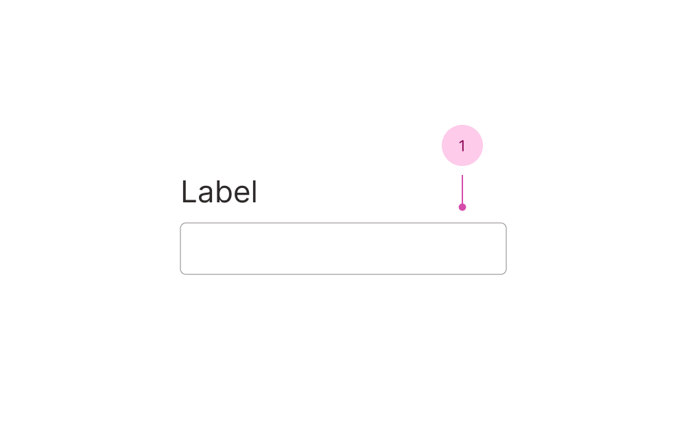

## Anatomy

1. Input

You'll find the label, descriptions and error messages documented in the [field component](/f/field).

## Use case

<Do11yDoDont do-title="Use when.." dont-title="Avoid when..">

<template v-slot:do>

- The text is unique and won't come from a dataset.

</template>

<template v-slot:dont>

- The user would benefit from seeing a list of options to pick from, use a select or combobox.
- You want a longer input or the text could benefit from being multiline, use [Textarea Field](/f/textarea-field).

</template>

</Do11yDoDont>
