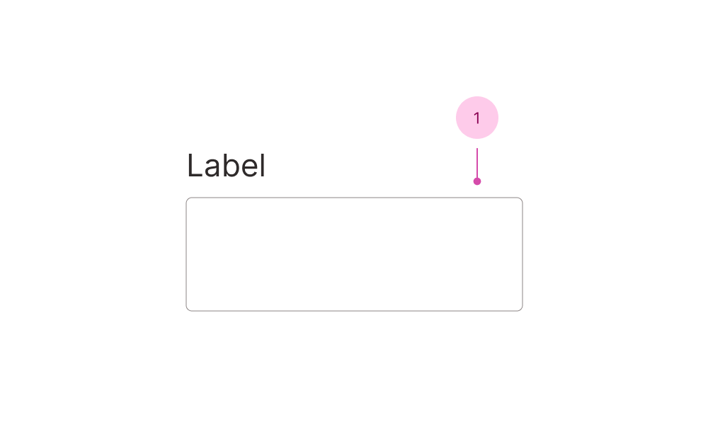

## Anatomy

1. Input

You'll find the label, descriptions and error messages documented in the [field component](/f/field).

## Use case

<Do11yDoDont do-title="Use when.." dont-title="Avoid when..">

<template v-slot:do>

- You need a long free-form text input.

</template>

<template v-slot:dont>

- The value should be short and concise, use [Text Field](/f/text-field).

</template>

</Do11yDoDont>
