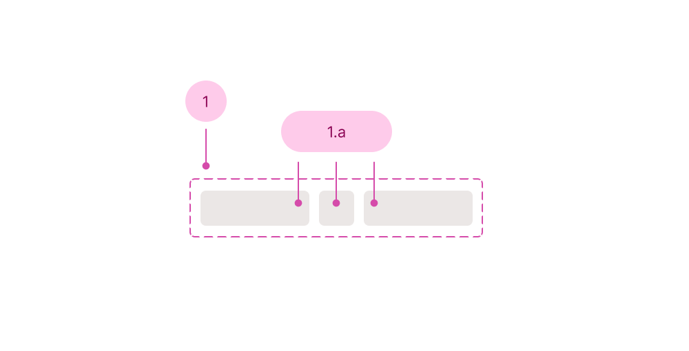

## Anatomy

1. Toolbar
   1. Supported sub-components, which are listed in the API section

## Use case

<Do11yDoDont do-title="Use when.." dont-title="Avoid when..">

<template v-slot:do>

- You want to purposefully group controls together.

</template>

<template v-slot:dont>

- There is less than 3 controls.

</template>

</Do11yDoDont>
